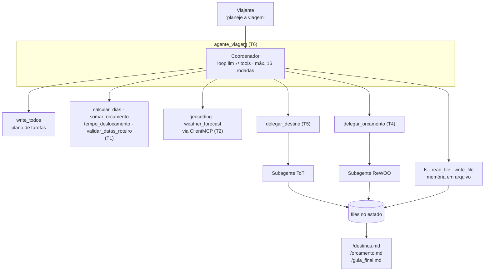
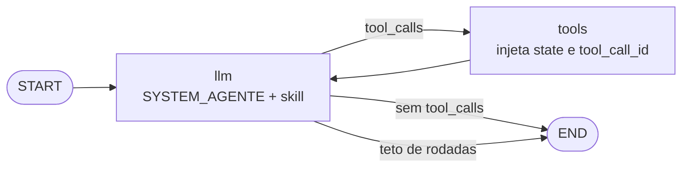
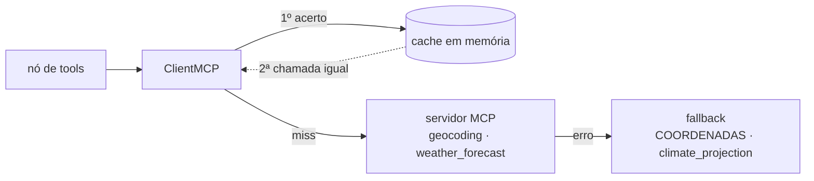
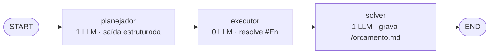
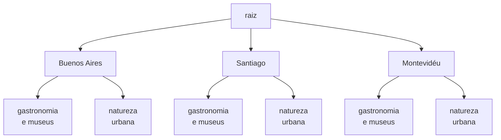
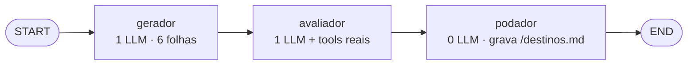
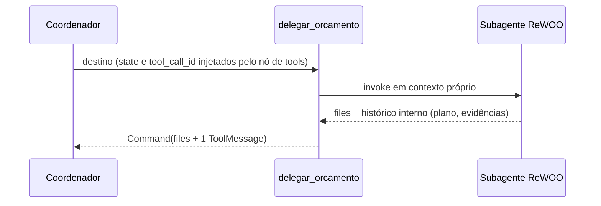

# Deep Agent de Planejamento de Viagem

Cenário fixo: 2 viajantes, saindo de GRU entre 12 e 19/10/2026, com R$ 12.000. Interesses em
gastronomia, museus e natureza urbana. Duas restrições: um viajante com mobilidade reduzida e
feriado local em 15/10. Candidatos: Buenos Aires, Santiago e Montevidéu.

Este documento vai do agente inteiro para dentro: primeiro o que ele é, depois cada camada que o
compõe.

---

## 1. O agente completo (Tarefa 6)

Um coordenador que decide, delega e escreve. Tudo o que ele produz de longo vai para arquivo; o que
circula na conversa são frases curtas.



---

## 2. O loop do coordenador (Tarefa 3)

Três nós, um ciclo. O roteador tem duas saídas: o modelo parou de pedir tools, ou o teto de passos
foi atingido.



O nó de tools faz três coisas que o `ToolNode` pronto não faria: injeta o estado do grafo nas tools
anotadas, injeta o `tool_call_id` nas tools de delegação (que montam a própria `ToolMessage`) e
devolve exceções como `ToolMessage` de erro, para o agente poder se corrigir em vez de derrubar o
grafo.

### O estado

| Campo | Reducer | Papel |
|---|---|---|
| `messages` | `add_messages` | a conversa |
| `files` | `merge_files` | memória em arquivo — **acumula** entre passos |
| `todos` | — | plano do coordenador, substituído a cada escrita |
| `cenario` | — | dados fixos da viagem |

`EstadoViagem` é a base. Cada subagente estende com os campos do seu próprio raciocínio
(`plano_orcamento`/`resultados_orcamento`, `folhas_destino`/`avaliacoes_destino`).

---

## 3. Camada determinística — tools locais (Tarefa 1)

Puras: recebem argumentos, calculam, devolvem JSON. Sem rede, sem estado.

| Tool | Devolve |
|---|---|
| `calcular_dias` | `{dias, noites}` — rejeita datas invertidas |
| `somar_orcamento` | `{total_brl, por_categoria}` |
| `tempo_deslocamento` | `{minutos, modal}` — a pé 4 km/h, público 18, táxi 25 |
| `validar_datas_roteiro` | `{valido, conflitos}` — duplicada, fora do intervalo, dia vazio |

---

## 4. Camada externa — MCP (Tarefa 2)

Cliente do `open-meteo-mcp-server`, rodando local via `npx`/stdio. Das 17 tools do servidor, o
agente recebe duas.



As tools do servidor são assíncronas e o grafo é síncrono: as chamadas passam por `_run_async`, e
sempre pelo `ClientMCP`, para não perder cache nem fallback.

---

## 5. Memória e conhecimento procedimental (Tarefa 3)

**Arquivos.** `ls`, `read_file` e `write_file` operam sobre o campo `files` do estado. `write_file`
devolve `Command`, e o reducer `merge_files` garante que uma gravação não apague as anteriores.

**Skill.** `skills/montar-dia-de-roteiro.md` — frontmatter com `name` e `description` (quando
aplica e quando **não** aplica), corpo com o procedimento: máximo de 4 atividades por dia, folga de
45 min entre elas, agrupamento por proximidade, tratamento da mobilidade reduzida e do feriado de
15/10, e o que fazer quando uma atração está fechada. O prompt do coordenador carrega o conteúdo
**lido do disco**, para que o arquivo entregue e o prompt executado nunca divirjam.

---

## 6. Subagente de orçamento — ReWOO (Tarefa 4)

Escolhido porque as quatro consultas são independentes e conhecidas de antemão. Um planejamento,
uma execução sem LLM, uma síntese.



O plano é sempre estes cinco passos:

```text
#E1 = consultar_voo(destino)
#E2 = consultar_hospedagem(destino)
#E3 = calcular_dias(data_ida, data_volta)
#E4 = montar_itens_orcamento(voo=#E1, hospedagem=#E2, dias=#E3['dias'], noites=#E3['noites'], viajantes)
#E5 = somar_orcamento(itens=#E4)
```

Cada argumento é um par `chave`/`valor`, e o valor pode ser literal, uma referência inteira (`#E1`)
ou uma referência a campo (`#E3['dias']`). O executor resolve essas referências e chama a tool —
nenhuma semântica de domínio fica no executor, ela está em `montar_itens_orcamento`, que é uma tool
como as outras.

---

## 7. Subagente de destino — Tree of Thoughts (Tarefa 5)

Escolhido porque o problema é de seleção entre alternativas, não de sequência de ações.





O ponto do avaliador é que ele **não chuta**: duas das quatro notas vêm de fora do modelo.

| Critério | Origem |
|---|---|
| custo estimado | tools de catálogo da Tarefa 4, normalizadas de 0 a 10 |
| clima | `weather_forecast` da Tarefa 2, penalizando temperatura fora de 18–28 °C e chuva |
| aderência aos interesses | julgamento do LLM |
| acessibilidade | julgamento do LLM |

O score é a média dos quatro. O podador descarta o que está abaixo da mediana, escolhe o melhor
entre os sobreviventes e grava em `/destinos.md` a tabela completa — inclusive as folhas podadas,
com a marca de por que caíram.

---

## 8. Como a delegação isola o contexto



O plano `#E1…#E5` e as evidências brutas morrem no subagente. Ao coordenador sobem os arquivos e
uma única mensagem. `delegar_destino` segue o mesmo padrão.

---

## 9. A execução

Nove rodadas, com o LLM e o servidor MCP reais:

```text
1 write_todos   4 delegar_orcamento   7 read_file
2 delegar_destino   5 write_todos     8 write_file
3 write_todos   6 read_file           9 write_todos
```

Montevidéu escolhido, score 9.15. Total de R$ 10.470,00 contra os R$ 12.000 disponíveis. Três
arquivos gravados (4.373 caracteres) contra ~2.783 tokens de conversa — o descarregamento de
contexto que o padrão promete.

| Tarefa | Peso | Verificação |
|---|---|---|
| 1 · tools locais | 10% | 8/8 |
| 2 · MCP | 10% | 3/3 |
| 3 · arquivos, skill, coordenador | 20% | 17/17 |
| 4 · ReWOO | 25% | 9/9 |
| 5 · ToT | 25% | 8/8 |
| 6 · integração | 10% | 7/7 |

---

## 10. Decisões que valem lembrar

- **`merge_files`** — sem esse reducer, cada `write_file` devolveria um `Command` que apaga os
  arquivos anteriores, e o guia final perderia `/destinos.md` e `/orcamento.md`.
- **Tools de arquivo em pt-BR, e não as do `deepagents`** — as prontas usam `file_path`/`content`,
  devolvem `ToolMessage`, guardam `FileData` e só executam dentro do grafo; a verificação exige
  `caminho`/`conteudo`, `Command` e `files` em string pura. O `FilesystemMiddleware` fica
  instanciado para declarar o contrato.
- **Argumentos do plano como pares `chave`/`valor`** — um `Dict[str, str]` quebra o schema estrito
  da saída estruturada da OpenAI (`Extra required key 'argumentos' supplied`).
- **Limite de passos no roteador**, não via `recursion_limit` — `.with_config()` devolveria um
  `RunnableBinding` e quebraria o `isinstance(..., CompiledStateGraph)` da verificação.
- **`tool_call_id` injetado nas delegações** — elas montam a própria `ToolMessage`; sem o id real,
  a resposta não casaria com o `tool_call` e o provedor rejeitaria a mensagem seguinte.
