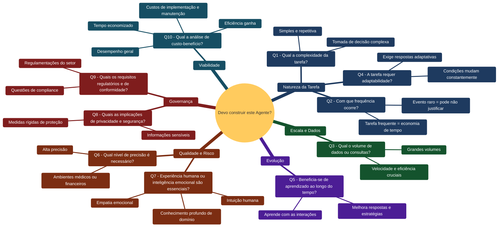
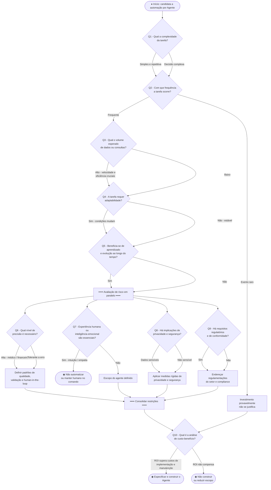

# Questões Norteadoras para a Construção de um Novo Agente

> Fonte: `A3-Especificando Agentes.cleaned.pdf`
> Escopo: Questões Norteadoras, Definição do Problema e Modelagem do Agente
> Contexto: *"Especificar um agente é como escrever uma descrição de cargo para um funcionário"* — você define missão, responsabilidades, recursos disponíveis e critérios de avaliação.

---

## 1. Mapa Mental — as 10 questões

---

## 2. Diagrama de Atividades (UML) — fluxo de decisão

---

## 3. As questões na íntegra

| # | Questão | Detalhamento |
|---|---------|----------------------|
| 1 | **Qual a complexidade da tarefa?** | A tarefa é simples e repetitiva, ou envolve uma complexa tomada de decisões que poderia se beneficiar da automação? |
| 2 | **Com que frequência a tarefa ocorre?** | Esta é uma tarefa frequente onde a automação pode economizar tempo significativo e recursos, ou é um evento raro que pode não justificar o investimento? |
| 3 | **Qual é o volume esperado de dados ou consultas?** | O agente lidará com grandes volumes de dados ou consultas onde velocidade e eficiência são cruciais? |
| 4 | **A tarefa requer adaptabilidade?** | As condições sob as quais a tarefa é realizada estão mudando constantemente, exigindo respostas adaptativas que uma IA pode gerenciar? |
| 5 | **A tarefa pode se beneficiar do aprendizado e evolução ao longo do tempo?** | Há algum benefício em ter um sistema que aprende com suas interações e melhora suas respostas ou estratégias ao longo do tempo? |
| 6 | **Qual nível de precisão é necessário?** | É essencial que a tarefa seja realizada com alta precisão, como em ambientes médicos ou financeiros, onde a IA pode precisar atender a altos padrões? |
| 7 | **A experiência humana ou a inteligência emocional são essenciais?** | A tarefa requer profundo conhecimento de domínio, intuição humana ou empatia emocional que a IA atualmente não pode fornecer? |
| 8 | **Quais são as implicações de privacidade e segurança?** | A tarefa envolve informações sensíveis que devem ser tratadas com medidas rígidas de privacidade e segurança? |
| 9 | **Quais são os requisitos regulatórios e de conformidade?** | Existem regulamentações específicas do setor ou questões de conformidade que precisam ser abordadas ao usar IA? |
| 10 | **Qual é a análise de custo-benefício?** | O retorno do investimento em termos de tempo economizado, eficiência ganha e desempenho geral supera os custos de implementação e manutenção de um sistema de IA? |

---

## 4. Leitura rápida — os quatro eixos

```mermaid
flowchart LR
    subgraph VIABILIDADE["VALE A PENA?"]
        A1["Q1 Complexidade"]
        A2["Q2 Frequência"]
        A10["Q10 Custo-benefício"]
    end
    subgraph CAPACIDADE["A IA CONSEGUE?"]
        B3["Q3 Volume"]
        B4["Q4 Adaptabilidade"]
        B5["Q5 Aprendizado"]
        B7["Q7 Limite humano"]
    end
    subgraph QUALIDADE["QUÃO CERTO PRECISA SER?"]
        C6["Q6 Precisão"]
    end
    subgraph GOVERNANCA["É PERMITIDO E SEGURO?"]
        D8["Q8 Privacidade e segurança"]
        D9["Q9 Regulatório e compliance"]
    end

    VIABILIDADE --> CAPACIDADE --> QUALIDADE --> GOVERNANCA --> DEC(["Especificação do Agente:<br/>missão, responsabilidades,<br/>recursos, critérios de avaliação"])
```

---

## 5. Passos para especificação do Agente

### 5.1. As questões de cada etapa

| Etapa | Questões norteadoras | Exemplo |
|---|---|---|
| **1. Identificar as necessidades e problemas** | De onde vem o problema? Do **mercado**, dos **clientes** ou da **sua experiência**? | *Clientes estão experienciando muito tempo de espera nas respostas para suas questões, levando a insatisfações.* |
| **2. Entender a audiência** | **Quem se beneficiará da solução?** **Que experiência gostariam de ter?** | *Clientes insatisfeitos têm potencial de impacto nos negócios.* |
| **3. Especificar os resultados desejados** | Qual é o **resultado final desejado** da solução — definido e especificado? | *Reduzir tempo de resposta aos clientes em 50% mantendo alta satisfação dos mesmos.* |
| **4. Identificar possíveis soluções e suas limitações** | **Quais soluções existentes podem ajudar?** **Quais limitações?** **Como um agente pode ser uma melhor solução?** | *FAQs ficam desatualizadas. Bots tradicionais não entendem consultas complexas dos usuários.* |

> Nota de fidelidade: na primeira etapa os itens originais são *"a partir do mercado / clientes / sua experiência"* — fontes de onde o problema emerge, não perguntas literais. Formulei-os como pergunta para manter o padrão da seção; as demais etapas já estão transcritas como perguntas no material.

## 6. Framework de Modelagem do Agente — tópicos a preencher

> *"O processo de modelagem de um agente envolve..."* — os 10 componentes abaixo, com a pergunta norteadora que o material traz entre chaves.

### 6.1. Template em branco — preencha para o seu agente

| # | Componente | Pergunta norteadora | Sua especificação |
|---|------------|---------------------|-------------------|
| 1 | **Objetivo** | Por que o agente existe? | |
| 2 | **Ambiente** | Qual o contexto de sua atuação? | |
| 3 | **Sensores** *[entrada]* | O que ele percebe? | |
| 4 | **Processamento de entrada** | Como a entrada é interpretada? | |
| 5 | **Estado** | O que ele sabe neste momento? | |
| 6 | **Comportamentos** | O que ele é capaz de fazer? | |
| 7 | **Ferramentas** | Quais recursos externos utiliza? | |
| 8 | **Geração de resposta** | Como a resposta é produzida? | |
| 9 | **Atuadores** *[saída]* | Como ele age / entrega o resultado? | |
| 10 | **Medida de Desempenho** | Quais os critérios de sucesso? | |

### 6.2. Referência — os dois exemplos do material

Os dois exemplos do material são complementares: o *planejador de viagens* preenche o **miolo** do framework (estado, comportamentos, ferramentas) e o *assistente virtual* preenche as **bordas** (ambiente, processamento, geração, atuadores). Juntos cobrem os 10 componentes.

| # | Componente | Exemplo — *planejador de viagens* | Exemplo — *assistente virtual* |
|---|------------|-------------------------------------|----------------------------------|
| 1 | Objetivo | Auxiliar o usuário a planejar viagens | — *(definido antes: responder questões dos clientes eficazmente e reduzir a espera em 50%)* |
| 2 | Ambiente | — | plataforma virtual e os clientes |
| 3 | Sensores *[entrada]* | mensagens, documentos, APIs, banco de dados | entrada de dados na interface de chat |
| 4 | Processamento de entrada | — | entendimento da consulta |
| 5 | Estado | `"destino": "Paris", "orcamento": 10.000, "dias": 7` | — |
| 6 | Comportamentos | pesquisar hotéis, consultar clima, gerar roteiro | — |
| 7 | Ferramentas | busca web, banco de dados, efetuar cálculos aritméticos | — |
| 8 | Geração de resposta | — | uso de prompt na LLM para geração da resposta / uso de tools |
| 9 | Atuadores *[saída]* | resposta textual, plano, relatório, ação | saída de dados na interface de chat |
| 10 | Medida de Desempenho | precisão, satisfação, tempo de resposta | precisão da resposta, tempo de resposta |

> Nota: o exemplo do *planejador de viagens* usa os rótulos *Entradas*, *Saída* e *Critérios de Sucesso*; mapeei-os para **Sensores**, **Atuadores** e **Medida de Desempenho**. As perguntas dos componentes 4 e 8 não constam do material original (aparecem lá sem chaves) — formulei-as para manter o padrão do template.
