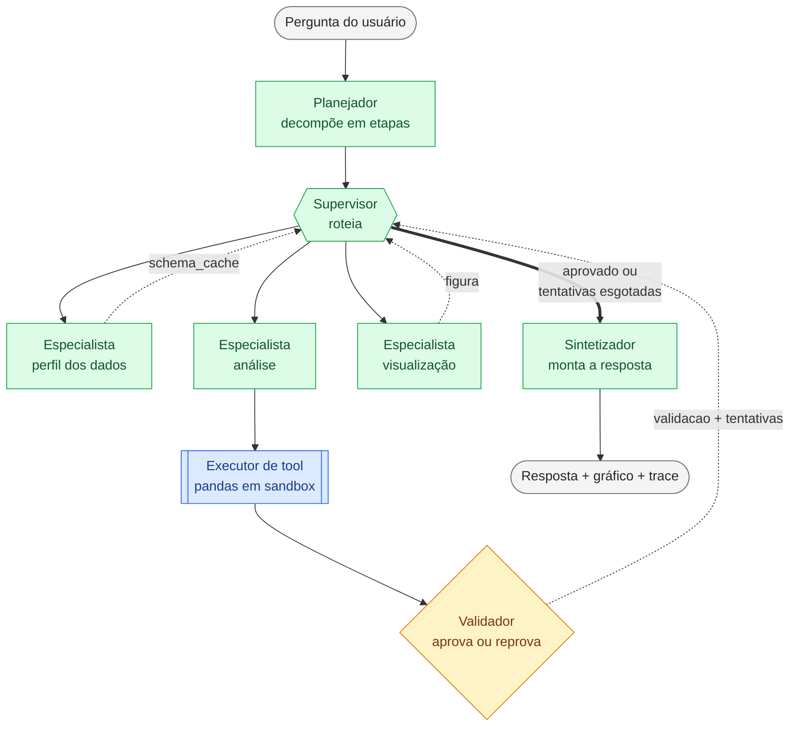

# INF0093 — Sugestões de Projeto (Sistemas Multiagentes)

| Requisito | Info |
|---|---|
| Grupo | 3 pessoas |
| Stack | Python, LangGraph, notebook Jupyter (`.ipynb`) |
| Entrega | Upload do notebook no Google Classroom |
| Datas | 06/09 · 13/09 · 20/09 · 04/10 |
| Pesos | v1 = 10% · v2 = 20% · v3 = 20% · v4 = 30% · apresentação = 20% |
| Extra | Vídeo de 5–10 min junto com o Entregável 4 |
| Pré-requisito | **01/09** — PDF de 1 página com nomes do trio + descrição do problema (não vale nota) |

**Tópicos obrigatórios para o sistema:**

- Revisão de agentes de IA
- Contexto, memória e ferramentas
- Planejamento e workflows
- Colaboração multiagente
- Coordenação, estado e compartilhamento de contexto
- Observabilidade
- Avaliação, confiabilidade e arquitetura
- Integração de projeto

### Calendário / Observações

- Entre **20/09 e 04/10** há **duas semanas** — a última entrega é a maior (30%) e acumula o vídeo.
- A primeira semana tem o feriado de **07/09**, logo após a Entrega 1.

### Critério de filtragem

- O maior risco em um projeto de 4 semanas é depender de **infraestrutura externa** (scraping, browser
automation, vector DB em servidor, APIs pagas ou com rate limit).
- Como tudo roda em notebook e o professor precisa conseguir reexecutar, foram priorizados temas com: 
  * dados **locais**
  * ferramentas **determinísticas** 
  * **ground truth** possível — para auxiliar o Entregável 4 (avaliação e confiabilidade)

## Sugestões

### Propostas

| id | Proposta | Problema |
|---|---|---|
| **1** | **Analista de Dados Aberto** ⭐ | Responder perguntas em linguagem natural sobre dataset público brasileiro (INEP, DATASUS, Portal da Transparência, CNPJ) |
| **2** | **Revisor de Código Multiagente** | Revisar um diff/arquivo com revisores especializados em paralelo |
| **3** | **Suporte sobre Base de Conhecimento (RAG multiagente)** | Responder dúvidas sobre corpus local (manuais, regulamentos, documentação) |
| **4** | **Triagem de Documentos Estruturados** | Extrair e conferir campos em documentos (currículos, notas fiscais, contratos) |
| **5** | **Assistente de Estudos Personalizado** | Ensinar um tópico fechado (ex.: complexidade de algoritmos) mantendo perfil do aluno |

### Cobertura por tipo de agente

| id | Supervisor | Planejador | Especialista | Retriever | Executor de tool | Validador | Sintetizador | Human-in-the-loop | Total |
|---|:---:|:---:|:---:|:---:|:---:|:---:|:---:|:---:|:---:|
| **1** | ✅ | ✅ | ✅ |  | ✅ | ✅ | ✅ |  | **6** |
| **2** |  |  | ✅ |  | ✅ | ✅ | ✅ |  | **4** |
| **3** | ✅ |  |  | ✅ |  | ✅ | ✅ | ✅ | **5** |
| **4** |  |  | ✅ |  | ✅ | ✅ | ✅ |  | **4** |
| **5** | ✅ | ✅ |  |  |  | ✅ |  | ✅ | **4** |

| Papel | O que faz |
|---|---|
| **Supervisor** | Orquestra: decide qual agente atua a seguir |
| **Planejador** | Decompõe a tarefa em etapas antes de executar |
| **Especialista** | Atua em paralelo com os demais sobre a mesma entrada (fan-out/fan-in) |
| **Retriever** | Seleciona trechos relevantes de um corpus |
| **Executor de tool** | Roda ferramenta determinística: código, linter, testes, regras, regex |
| **Validador** | Valida a saída e pode devolver o trabalho ao agente anterior |
| **Sintetizador** | Consolida as saídas parciais no entregável final |
| **Human-in-the-loop** | Ponto de interrupção com decisão ou entrada humana |

### Avaliação, esforço e risco

| id | Como avaliar (E4) | Esforço | Risco | Cobre a ementa |
|---|---|---|---|---|
| **1** | 25–30 perguntas com resposta calculada à mão em pandas → acurácia automática | Médio | **Baixo** | ⭐⭐⭐⭐⭐ |
| **2** | Injetar ~15 bugs conhecidos num repo pequeno → precision/recall | Médio-alto | Baixo | ⭐⭐⭐⭐⭐ |
| **3** | Groundedness + taxa de alucinação; perguntas fora do corpus para testar recusa | Médio | Baixo | ⭐⭐⭐⭐ |
| **4** | F1 por campo — a avaliação mais objetiva de todas | Baixo | Baixo | ⭐⭐⭐ |
| **5** | Rubrica + LLM-as-judge (subjetivo) | Médio | **Médio** | ⭐⭐⭐ |

## Recomendação: Analista de Dados Aberto

**Por quê:** as ferramentas são óbvias e determinísticas, o estado compartilhado é natural (schema +
histórico + resultados intermediários), o ciclo `Especialista ↔ Validador` demonstra coordenação real, e a
avaliação é automática. Escolham um dataset com identidade própria para o projeto não parecer um code
interpreter genérico.

### Desenvolvimento x Entregas

| Entrega | Escopo | Tópicos cobertos |
|---|---|---|
| **1** | Um agente com `Executor de tool`: carrega o CSV, inspeciona o schema e responde 5 perguntas num loop ReAct simples. | Revisão de agentes de IA; contexto, memória e ferramentas |
| **2** | Vira grafo LangGraph com estado tipado: `Planejador` → `Supervisor` roteando três `Especialista` (perfil dos dados, análise, visualização) → `Sintetizador`. Roteamento condicional. | Planejamento e workflows; colaboração multiagente |
| **3** | Fecha o ciclo: `Validador` grava o veredito e o `Supervisor` reencaminha ao `Especialista` quando o resultado não passa. Checkpointer (`SqliteSaver`) para memória entre sessões e logging de traces, custo e tokens. | Coordenação, estado e compartilhamento de contexto; observabilidade |
| **4** | Suíte de avaliação com ground truth, retry/fallback, guardrails no `Executor de tool`, relatório de arquitetura + vídeo. Nenhum papel novo. | Avaliação, confiabilidade e arquitetura; integração de projeto |

### Arquitetura



### Exemplo de execução ponta a ponta

Trace de uma pergunta real sobre o **IDEB por município (INEP)**, mostrando o que cada elemento recebe,
decide e devolve. A 1ª tentativa falha de propósito — é ela que exercita o ciclo do `Validador`.

---

**👤 Usuário**

> Quais os 5 municípios de São Paulo com maior queda no IDEB dos anos finais entre 2019 e 2023?
> Mostra num gráfico.

---

**🧭 Planejador** — lê a pergunta, escreve `plano`

Decompõe em etapas antes de qualquer código ser gerado:

1. identificar as colunas de IDEB dos anos finais para 2019 e 2023
2. filtrar UF = SP
3. calcular a variação `2023 - 2019` por município
4. ordenar ascendente e pegar os 5 primeiros
5. gerar gráfico de barras

---

**🔀 Supervisor** — decide o próximo nó

`schema_cache` está vazio → roteia para o `Especialista (perfil dos dados)`.

---

**🔍 Especialista (perfil dos dados)** — escreve `schema_cache`

Inspeciona o CSV sem trazer os dados para o contexto do LLM:

```python
df.shape          # (5570, 34)
df.columns        # ['co_municipio', 'no_municipio', 'sg_uf', 'ideb_af_2019', 'ideb_af_2023', ...]
df['sg_uf'].unique()[:5]
df[['ideb_af_2019','ideb_af_2023']].isna().sum()   # 412 e 388
```

Devolve ao estado: nomes de coluna, tipos, cardinalidade de `sg_uf` e **a contagem de nulos** — que será
decisiva na validação.

---

**🔀 Supervisor** → `Especialista (análise)`

---

**📊 Especialista (análise)** — tentativa 1, escreve `codigo_gerado`

```python
sp = df[df['sg_uf'] == 'SP'].copy()
sp['queda'] = sp['ideb_af_2023'] - sp['ideb_af_2019']
resultado = sp.nsmallest(5, 'queda')[['no_municipio', 'ideb_af_2019', 'ideb_af_2023', 'queda']]
```

---

**⚙️ Executor de tool** — roda em sandbox, escreve `resultado`

Executa o código com timeout e sem acesso a rede ou disco. Retorna o DataFrame serializado:

```
no_municipio   ideb_af_2019  ideb_af_2023  queda
Município A            NaN           3.1     NaN
Município B            5.4           3.2    -2.2
...
```

---

**✅ Validador** — tentativa 1: **reprovado**, escreve `validacao`

Confere o resultado contra o `plano` e o `schema_cache`:

| Checagem | Resultado |
|---|---|
| Retornou 5 linhas? | ✅ |
| Filtrou a UF pedida? | ✅ |
| Colunas do plano presentes? | ✅ |
| Livre de `NaN` na coluna ordenada? | ❌ **`nsmallest` levou `NaN` para o topo** |

Escreve em `validacao`: *"a coluna `queda` tem nulos; municípios sem IDEB em 2019 estão sendo contados como
maior queda. Descarte os nulos antes de ordenar."* Incrementa `tentativas` para 1 e **devolve o controle ao
`Supervisor`** — não chama o `Especialista` diretamente.

---

**🔀 Supervisor** — lê `validacao` e `tentativas`

Reprovado e `tentativas < 3` → roteia de volta para o `Especialista (análise)`, passando o feedback.
Se `tentativas` tivesse chegado a 3, iria direto ao `Sintetizador` com a ressalva de falha.

---

**📊 Especialista (análise)** — tentativa 2

```python
sp = df[df['sg_uf'] == 'SP'].dropna(subset=['ideb_af_2019', 'ideb_af_2023']).copy()
sp['queda'] = sp['ideb_af_2023'] - sp['ideb_af_2019']
resultado = sp.nsmallest(5, 'queda')[['no_municipio', 'ideb_af_2019', 'ideb_af_2023', 'queda']]
```

---

**⚙️ Executor de tool** → 5 municípios, sem nulos.

**✅ Validador** — tentativa 2: **aprovado**. Escreve o veredito e devolve ao `Supervisor`.

**🔀 Supervisor** — resultado aprovado, `figura` ainda vazia → roteia para o `Especialista (visualização)`.

---

**📈 Especialista (visualização)**

Gera o gráfico de barras horizontais a partir de `resultado` — sem reexecutar a análise, só formata o que
já foi validado. Escreve `figura` e devolve ao `Supervisor`.

**🔀 Supervisor** — resultado aprovado e `figura` pronta → roteia para o `Sintetizador`.

---

**📝 Sintetizador** — monta a resposta final

> Entre 2019 e 2023, os 5 municípios paulistas com maior queda no IDEB dos anos finais foram […],
> com quedas de 2,2 a 1,7 ponto.
>
> **Observação:** 388 municípios de SP não têm IDEB em 2023 e foram excluídos do ranking.

Entrega ao usuário: texto + gráfico + trace (nós percorridos, 2 tentativas, custo em tokens).

---

#### Escopo de cada elemento

O que mais atrapalha na implementação é um agente invadir a função do outro. Esta tabela é o contrato:

| Elemento | Decide | Escreve no estado | **Não faz** |
|---|---|---|---|
| **Planejador** | como quebrar a pergunta em etapas | `plano` | não olha os dados nem escreve código |
| **Supervisor** | qual nó roda a seguir, inclusive o retry e a desistência | — | não interpreta os dados nem reescreve o plano |
| **Especialista** (perfil) | quais colunas e nulos importam | `schema_cache` | não responde a pergunta |
| **Especialista** (análise) | qual código pandas responde a etapa | `codigo_gerado` | não executa o código nem julga o próprio resultado |
| **Executor de tool** | nada — é determinístico | `resultado` | não corrige o código que recebeu |
| **Validador** | se o resultado passa ou não | `validacao`, `tentativas` | não conserta o código nem escolhe o próximo nó |
| **Especialista** (visualização) | forma do gráfico | `figura` | não recalcula os números |
| **Sintetizador** | o que vira resposta ao usuário | `historico` | não altera números nem esconde limitação |

Três pontos que valem para a nota:

- **O `Executor de tool` não é um agente** — é ferramenta determinística. Manter isso separado do
  `Especialista (análise)` é o que permite medir quantas execuções falharam, e é a base da observabilidade
  da Entrega 3.
- **O `Validador` descreve, não corrige.** Se ele reescrever o código, vocês perdem o ciclo — e o ciclo é
  exatamente o que a Entrega 3 pede.
- **Todo nó volta ao `Supervisor`.** 
- O `Validador` só grava o veredito; quem decide retry, visualização,
  síntese ou desistência é o `Supervisor`. 
- Com um único ponto de roteamento, o corte `tentativas < 3`, e na prática, esse roteamento é uma `add_conditional_edges` (determinístico).

## Decisões a tomar antes de 01/09

| Decisão | Por que trava o resto |
|---|---|
| **Provedor de LLM e chave** | Quem paga; e o notebook precisa funcionar com as saídas salvas nas células, para ser legível sem reexecutar |
| **O dataset** | Define o escopo inteiro — escolher **antes** de escrever qualquer linha de código |
| **Divisão do trio** | Sugestão: 1 pessoa por eixo — grafo/estado, agentes/prompts, avaliação/observabilidade |

## O que evitar

- Vector DB em servidor, scraping, browser automation, APIs pagas ou com rate limit.
- Mais de 5–6 agentes: o custo de coordenação cresce mais rápido que a nota.
- Deixar a avaliação para a última semana — ela é 30% e precisa de ground truth construído com antecedência.
- Notebook que só funciona com estado residual de execuções anteriores.

## Referências

- PDD da disciplina: `eval/PDD_2026_2S_-_INF0093.cleaned.pdf`
- Handout Aula 1: `w1/_INF0093__2026_2S___Aula_1_handout.cleaned.pdf`
- Bojie Li, *AI Agents in Depth* — https://github.com/bojieli/ai-agent-book
- Documentação LangGraph — https://github.com/langchain-ai/langgraph
- Banco de ideias sugerido em aula — https://github.com/ashishpatel26/500-AI-Agents-Projects
