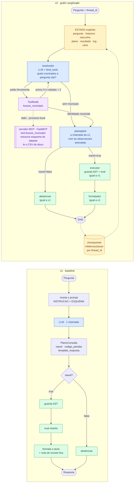

# Entregável 2 — Plano de desenvolvimento da v2

**Prazo:** 13/09/2026 (Classroom) · **Entrega:** `eval/release_2/v1.0/E2_DallaCosta_Murer_Denzin.ipynb`
**Modelo:** `openai/gpt-oss-20b`, `temperature=0` — obrigatoriamente o mesmo da v1. Trocar o modelo
invalidaria a comparação.

---

## 1. A ideia, em cinco linhas

A v1 continua inteira. Envolvemos ela em um grafo LangGraph e acrescentamos **três coisas, que são
exatamente as três que o enunciado exige**: orquestração, memória e uma ferramenta servida por um
**servidor MCP local**.

Não entram Validador, Sintetizador, Clarificador nem sandbox. Eles ficam para o E3 e o E4. O E2 vai
**medir que as limitações que eles resolvem continuam lá**, e é esse número que vai justificá-los.

---

## 2. O que muda

| | v1 (entregue em 07/09) | v2 (esta entrega) |
|---|---|---|
| Orquestração | uma função Python linear | grafo LangGraph com estado explícito |
| Ferramentas | nenhuma | 1, servida por um **servidor MCP local** (stdio) |
| Memória | nenhuma, cada pergunta começa do zero | checkpointer por `thread_id`, **só em sessão** |
| Chamadas ao LLM | 1 por pergunta | 2 por pergunta; 3 quando a busca não encontra e há nova rodada |
| Guarda AST, `eval`, formatação, nota de recorte | — | **idênticos, sem uma linha alterada** |
| Execução | síncrona | assíncrona (`ainvoke`), exigência do cliente MCP |
| Validação do resultado | nenhuma | **nenhuma, de propósito** (E3) |
| Texto escrito antes do resultado | sim | **sim, de propósito** (E3) |

---

## 3. Os desenhos



Azul é chamada ao LLM. Verde é etapa determinística, código da v1 sem alteração. Amarelo é estado e
memória. Roxo é a ferramenta e o servidor que a serve.

**Local quer dizer local:** o servidor sobe como um subprocesso da própria sessão, conversa por
entrada e saída padrão (`stdio`) e lê o CSV do disco. Nenhum serviço remoto, nenhuma porta de rede,
nenhuma chamada externa. É o mesmo arranjo da Aula 4.

---

## 4. Os nós e os roteadores

| Nó | Usa LLM? | O que é | Muda em relação à v1? |
|---|---|---|---|
| **resolvedor** | sim | pergunta só uma coisa ao modelo: *quais municípios a pergunta cita?* Chama `buscar_municipio` para cada um | **nó novo** |
| **ferramentas** | não | `ToolNode` com as ferramentas do servidor MCP | **nó novo** |
| **planejador** | sim | `montar_prompt` + `structured_llm`, **a chamada da v1 sem alteração**, com as observações da ferramenta anexadas ao fim do prompt | a chamada é a mesma; o prompt ganha um bloco |
| **executor** | não | `codigo_seguro` + `executar` da v1 | não |
| **formatador** | não | `formatar_valor` + template + nota de recorte da v1 | não |
| **abstencao** | não | o texto de abstenção da v1 | não |

**Por que duas etapas de LLM, e não uma.** A primeira tentativa foi uma só: um planejador com
`bind_tools` que encerraria o laço chamando uma ferramenta de controle `emitir_plano`, cujos
argumentos seriam o `PlanoConsulta` da v1. Medido em 08/09, o modelo **truncou o raciocínio em 2.048
tokens de saída** e não emitiu nenhuma chamada de ferramenta, caindo na rede de segurança e gerando
código errado. Adotamos então o **Plano B** já previsto neste plano: separar as responsabilidades.

A separação saiu mais barata do que parecia e trouxe dois ganhos:

- cada chamada fica **curta e confiável** — o resolvedor recebe um prompt de dez linhas, não o
  `INSTRUCAO` inteiro mais duas regras novas;
- a chamada de planejamento continua sendo, **literalmente**, a da v1. Na configuração de controle o
  resolvedor é saltado e o planejador recebe o prompt da v1 sem uma vírgula a mais, o que torna a
  ablação limpa: v1 → v2 sem ferramenta isola a orquestração; v2 sem ferramenta → v2 isola a
  ferramenta.

**Os roteadores, quatro decisões:**

1. **Entrada:** com ou sem busca. É a chave da ablação.
2. **Depois do resolvedor:** pediu ferramenta? vai ao `ToolNode`; não pediu? vai direto ao planejador.
3. **Depois da busca, sem LLM:** alguma busca voltou com `encontrados = 0` e ainda há rodada
   disponível? volta ao resolvedor para tentar outra grafia; senão, segue ao planejador.
4. **Depois do planejador:** `viavel` decide entre `executor` e `abstencao` — é o mesmo `if` da v1,
   agora como aresta.

**Freios:** `recursion_limit=15` no `ainvoke` e no máximo **2** rodadas de busca
(`MAX_RODADAS_BUSCA`). `GraphRecursionError` é capturado e o caso vai para a tabela de modos de falha.

## 5. As três adições, e o porquê de cada uma

### 5.1 Orquestração em LangGraph

**Problema:** hoje o fluxo é uma função. Nenhuma etapa é observável, medível ou reordenável.

**O que ganhamos agora:** estado explícito e um log por transição, com as chamadas de ferramenta e
seus argumentos. É a base da observabilidade que o projeto prometeu desde a proposta.

**O que ganhamos depois:** no E3, inserir o Validador entre o executor e o formatador passa a ser
acrescentar um nó e uma aresta, sem reescrever o sistema.

### 5.2 Memória por checkpointer, só em sessão

**Problema:** cada pergunta começa do zero. Uma pergunta de acompanhamento como *"e em matemática?"*
não tem a quem se referir.

**Como:** `InMemorySaver` indexado por `thread_id` (uuid4, não adivinhável). Guardamos só um
histórico compacto (`pergunta`, `codigo`, `resposta_curta`), não a transcrição bruta. **Nada é
gravado em disco:** ao reiniciar o kernel a memória zera, e isso é o comportamento esperado.

**Como demonstramos** (o enunciado pede a falha antes do incremento):

1. Turno 1: "Qual é a média geral de Campinas, em São Paulo?" → 584,24.
2. Turno 2 **sem** checkpointer: "E em matemática?" → não há antecedente; erra ou pede a cidade.
3. Turno 2 **com** checkpointer, mesmo thread → reaproveita o filtro e devolve a média de matemática.

Mais duas medições curtas: o crescimento do contexto ao longo de 5 turnos, e o isolamento entre dois
`thread_id` diferentes.

**Importante:** os 13 casos congelados continuam rodando *stateless*, um thread novo por caso. A
régua da comparação não muda.

### 5.3 O servidor MCP local e sua ferramenta

**Problema:** o modelo precisa adivinhar como o município se chama dentro do dataset. Ele não vê os
dados, só o esquema textual.

**O que o servidor expõe:**

```python
# tool
buscar_municipio(nome: str, uf: str | None = None) -> list[dict]
# busca sem acento, sem caixa e sem apóstrofo na coluna municipio
# devolve [{municipio, uf, n_participantes, media_geral}, ...]

# resource
"dataset://enem2023/esquema"   # a descrição das 15 colunas
```

O *resource* é a segunda primitiva do MCP e tem uma consequência arquitetural real: hoje o notebook
monta o `ESQUEMA` a partir do `df`; atrás do servidor, **quem tem os dados passa a ser quem os
descreve**.

**Como o dataset chega ao servidor:** o notebook baixa o CSV uma vez, grava em disco e passa o caminho
ao servidor por argumento de linha de comando. Assim o servidor não acessa rede: só leitura de um
arquivo local, que é o menor privilégio possível para a capacidade.

**Se o grupo quiser uma segunda tool**, a candidata é `perfil_coluna(coluna)`, devolvendo mínimo,
mediana, máximo e quantis. Ela só deve entrar se algum caso de avaliação a exercitar: ferramenta que
nunca é chamada não conta como uso de ferramenta e enfraquece a análise.

---

## 6. A evidência: rodamos a v1 hoje (08/09)

Reproduzimos a v1 célula por célula e testamos três perguntas novas. O resultado é o melhor argumento
do plano.

| Pergunta | Código que a v1 gerou | Resultado |
|---|---|---|
| média de matemática em **Santana do Livramento** | `df.loc[df.municipio == "Santana do Livramento", "media_mt"].iloc[0]` | **`IndexError`** — no IBGE o nome é `Sant'Ana do Livramento` |
| a mesma, citando o Rio Grande do Sul | idem, com `& (df.uf == "RS")` | **`IndexError`** |
| quantos participantes teve **Bom Jesus** | `df.loc[df.municipio == "Bom Jesus", "n_participantes"].sum()` | **169**, e o texto diz *"O município Bom Jesus teve 169 participantes"* |

O primeiro é o **primeiro erro de execução** do conjunto: a v1 tinha zero. O terceiro é um **erro
silencioso**: somou cinco municípios homônimos (PB 6, PI 123, RN 4, RS 32, SC 4) e apresentou o total
no singular, como se fosse um município só.

Nenhum dos dois se corrige mexendo no prompt. O modelo não tem como saber a grafia nem a
multiplicidade sem **ler os dados**. É esse trabalho que a ferramenta faz, e o retorno dela depende
inteiramente da entrada — que é o que o enunciado exige de uma ferramenta de verdade.

---

## 7. Memória: o enunciado pede persistência em disco?

**Não.** A seção 3.2 diz:

> "Quando aplicável, implemente **memória de curto prazo ou checkpointing** e mostre pelo menos um
> caso em que uma interação posterior depende do contexto anterior."

Os pontos adicionais são custo do contexto e isolamento, ambos "quando aplicável". Nada exige
durabilidade entre execuções. A seção 4 reforça: o notebook é avaliado "executado do início ao fim e
salvo com as saídas visíveis", ou seja, a demonstração acontece dentro de uma única execução. A
Aula 4 usa `MemorySaver` e comenta no próprio código que ele "some ao reiniciar o kernel".

| Escopo | O E2 exige? | Nossa decisão |
|---|---|---|
| Dentro de um turno (estado do grafo) | sim, é o "estado explícito" da seção 3.1 | `Estado` TypedDict |
| Entre turnos da mesma sessão | **sim**, é o "checkpointing" da seção 3.2 | `InMemorySaver` |
| Entre sessões, gravado em disco | **não** | fora do escopo desta entrega |

**Decisão do grupo: nada persistido.** A demonstração obrigatória acontece em turnos consecutivos da
mesma execução, e disco não acrescentaria evidência nenhuma. O roadmap sugerido pelo professor coloca
"memória entre sessões" no E3, e é lá que a discussão volta.

---

## 8. Por que MCP, e por que sem caminho alternativo

**Decisão do grupo: servidor MCP local, sem fallback para ferramenta local.** A capacidade integrada é
o *acesso ao artefato de dados* (ENEM 2023 × IBGE 2021), e ela fica atrás da fronteira desde já.

A tabela de sinais da Aula 4, aplicada ao nosso caso com honestidade:

| Sinal | Nosso caso | Aponta para |
|---|---|---|
| A integração tem dono e ciclo de vida próprios | sim: o artefato vem do ETL, é versionado e congelado junto com o conjunto de avaliação | **MCP** |
| Dois ou mais agentes consomem a mesma capacidade | no E3: Validador confere `n_participantes`, Visualizador obtém as séries | **MCP** |
| Precisa de fronteira padronizada entre quem usa e quem implementa | é o passo que torna o corte multiagente barato no E3 | **MCP** |
| Só este agente usa a capacidade hoje | verdade nesta versão | tool local |
| A interface ainda está mudando | o grafo muda, mas a assinatura da busca é estável | tool local |

Os dois últimos sinais apontam para o outro lado, e não vamos esconder isso. A escolha é uma **aposta
arquitetural declarada**: estabelecer a fronteira agora, enquanto ela tem um consumidor só e custa
pouco, em vez de introduzi-la no E3 junto com dois clientes novos. O enunciado pede exatamente essa
consideração explícita quando o projeto envolve recursos que serão reutilizados por múltiplos agentes.

**O que aceitamos pagar:**

| Custo | Consequência prática |
|---|---|
| O grafo passa a ser assíncrono | nós e execução com `ainvoke`, como na Aula 4 |
| O retorno vem como lista de blocos de conteúdo, não string | desempacotamento explícito antes de entrar no prompt |
| O servidor é outro processo | se ele morrer, as ferramentas desaparecem: **modo de falha que a tool local não tinha** |
| `stderr` do subprocesso no Jupyter e no Colab | redirecionado para `servidor_mcp.log`, o primeiro lugar a olhar quando algo falhar |
| Duas dependências novas | `mcp` e `langchain-mcp-adapters`. Resolução conferida em 08/09 sem instalar nada: acrescenta 13 pacotes e **não rebaixa** `langchain-core` (1.6.1), `langgraph` nem `pandas` |

**Sem fallback significa que o servidor é caminho único.** Se ele não subir, o notebook não roda. A
mitigação não é um plano B escondido, é antecipar o teste: subir o servidor no Colab **no dia 09**,
não na véspera. O log do servidor é a evidência de que existe outro processo do outro lado, e vai
impresso no notebook.

**Contrato e segurança.** Preenchemos o `contrato_integracao` do template com capacidade, tools,
resource, clientes previstos, justificativa, alternativa descartada e privilégio. O privilégio é
**somente leitura de um arquivo local**, sem rede e sem escrita. O retorno da ferramenta entra no
prompt delimitado e tratado como dado, nunca como instrução, e toda chamada é registrada com seus
argumentos no log.

---

## 9. O que não entra agora, e por quê

| Limitação da v1 | Evidência | Entra em |
|---|---|---|
| Texto escrito antes de o resultado existir | desenho da v1 | E3, Sintetizador |
| Resultado frágil entregue como robusto | T12 → Uru/SP, média 741, **1 participante** | E3, Validador |
| Interpretação escolhida em silêncio | T13 → município (572,26) sem citar o estado (527,89) | E3, Clarificador |
| Nota de recorte fixa, cita IBGE 2021 sem cruzar IBGE | RF-07 parcial | E3, Sintetizador |
| Execução no mesmo processo, sem timeout | seções 13 e 19 do E1 | E4, sandbox |

Adicionar tudo agora gastaria o incremento das próximas entregas e apagaria justamente o ganho que se
quer medir. Foi o mesmo raciocínio que usamos para escolher o baseline no E1.

---

## 10. Casos de teste

Os **13 casos congelados** do E1 são reaproveitados sem nenhuma alteração, com as mesmas funções de
verificação e o mesmo esquema de saída. Conferimos um *fingerprint* sha256 do conjunto contra o E1
para provar que ele não mudou. O baseline é **reexecutado nesta entrega**, no mesmo dia e ambiente.

Dois casos novos, cada um com a falha da v1 já medida:

| ID | Pergunta | Referência | Verificação |
|---|---|---|---|
| **T14** | "Qual é a média em matemática de Santana do Livramento?" | 530,26 (`Sant'Ana do Livramento`, RS, 275 participantes) | automática, numérica, tolerância de 1% |
| **T15** | "Quantos participantes teve Bom Jesus?" | 5 municípios: PB 6, PI 123, RN 4, RS 32, SC 4 | rubrica manual 0–2, a mesma de T12 e T13 |

T15 fica na rubrica manual de propósito: as siglas de UF têm duas letras e colidem por substring com
a nota de recorte fixa (a palavra "inscritos" contém "sc"). Rubrica declarada é melhor que verificação
frágil.

---

## 11. O que esperamos medir

Rodamos **três configurações** sobre a mesma régua:

| Configuração | O que é | Para que serve |
|---|---|---|
| **v1** | o baseline, reexecutado hoje | referência |
| **v2 sem ferramenta** | o mesmo grafo, sem as tools do servidor | provar que a orquestração **preserva o comportamento** |
| **v2** | o grafo completo, com o servidor MCP | medir o ganho, que passa a ser atribuível só à ferramenta |

O controle do meio custa 13 chamadas e é o que elimina a dúvida: se ele empatar com a v1 em 11/11,
toda diferença observada na v2 vem da ferramenta, e não do refactor nem da mudança de prompt.

| Onde | Expectativa | Por quê |
|---|---|---|
| 13 casos congelados | **empate**, 11/11 nos automáticos | a v1 já está no teto dessa régua e nada do que acrescentamos ataca o que ela acerta |
| T14 | v1 falha, **v2 acerta** | a ferramenta resolve a grafia; já medimos a falha |
| T15 | v1 = 0, **v2 melhora** | a ferramenta revela os 5 homônimos |
| Acompanhamento com memória | capacidade **nova** | a v1 não faz, em nenhuma configuração |
| Chamadas ao LLM | 1 → 2 quando consulta os dados | é o custo da autonomia, e é medido, não estimado |
| Latência | **sobe** | uma chamada a mais, mais o processo do servidor |
| T12, T13 e as demais limitações | **continuam** | é o resultado que justifica o E3 |

Uma v2 que empata na régua principal é **resultado válido** — o enunciado diz isso explicitamente. O
que se avalia é a qualidade da investigação. Vamos afirmar por caso ("a v2 acertou T14, que a v1
errava"), nunca "a v2 é melhor".

---

### Resultado da execução de 08/09 (o notebook tem a análise completa)

Implementado e executado do início ao fim: 78 células, 48 de código, **zero erros**, 750 s.

| Medida | v1 | v2 sem ferramenta | v2 |
|---|---|---|---|
| Acertos nos 13 congelados | 10/11 | **11/11** | 10/11 |
| Acertos no conjunto de 15 | 10/12 | 11/12 | 10/12 |
| Chamadas ao LLM | 15 | 15 | **30** |
| Chamadas a ferramenta | 0 | 0 | 8 |
| Latência mediana | 9,7 s | 7,8 s | 15,2 s |
| Custo | US$ 0,0063 | US$ 0,0064 | US$ 0,0085 |

Cinco achados que valem para o E3:

1. **Empate na régua congelada.** Toda a diferença está em T03, o mesmo caso, por variação de
   geração. Com 11 casos automáticos, um acerto vale 9 pontos: não há tendência aqui.
2. **O baseline reexecutado deu 10/11, e não os 11/11 do E1** — mesmo modelo, mesma temperatura,
   mesmo prompt, outro dia. É a prova prática de por que o enunciado exige reexecutar na mesma sessão.
3. **T14 é o caso mais instrutivo.** A ferramenta funcionou: só a v2 produziu `Sant'Ana do
   Livramento`. Mas o modelo emitiu as aspas escapadas e a guarda herdada recusou o código. A v2
   resolveu a limitação que se propôs a resolver e foi derrubada por outra, que ela não se propôs a
   resolver nesta versão.
4. **T15 melhorou de 0 para 1** na rubrica: a v2 declara que os 169 participantes são de cinco
   municípios homônimos. T12 e T13 continuam em 0 nas três configurações, como previsto.
5. **A latência não é sinal confiável aqui.** A configuração sem ferramenta faz o mesmo trabalho da
   v1 e teve mediana menor. O custo confiável é chamada e token, que dobrou.

A pergunta obrigatória fica respondida com dado: **o Validador**, porque 3 das 5 falhas de execução
desta rodada são mecânicas, detectáveis e recuperáveis por uma nova tentativa — e foi a única
categoria de falha que atingiu as duas versões.

---

## 12. Cobertura do enunciado

| Exigência | Onde atendemos |
|---|---|
| Estado explícito | `Estado` TypedDict |
| Fluxo com mais de uma etapa | planejador → executor → formatador |
| Ao menos uma ferramenta útil | `buscar_municipio`, com a falha da v1 medida como prova |
| Roteamento condicional ou seleção de ferramenta | roteador de três saídas, mais a escolha entre as duas tools |
| Término com limite explícito de passos | `recursion_limit=15`, com o estouro registrado como falha |
| Workflow × ReAct × híbrido, justificado pelo problema | workflow determinístico com um laço agente–ferramenta |
| Memória de curto prazo ou checkpointing | `InMemorySaver` por `thread_id` |
| Falha sem memória, demonstrada primeiro | turno 2 sem e com checkpointer |
| Custo do contexto e estratégia de contenção | tabela de 5 turnos; histórico compacto |
| Isolamento entre conversas | dois `thread_id` |
| Integração: descrever, classificar, justificar, demonstrar | seção 8, com o servidor rodando e o log impresso |
| MCP considerado explicitamente | seção 8, incluindo os sinais que apontam para o outro lado |
| Retorno de ferramenta como entrada não confiável | delimitação no prompt, menor privilégio, log com argumentos |
| Baseline reexecutado, mesmo modelo | `baseline()` intocado, mesma sessão |
| Conjunto congelado, casos novos só acrescentados | 13 + 2, com fingerprint conferido |
| Comparação nas sete dimensões pedidas | tabela por caso e resumo, nas três configurações |
| Novos modos de falha | lidos do log, incluindo o servidor cair e o plano não ser emitido |
| Análise arquitetural | seção 9, com o que caiu e o que ficou |
| Pergunta obrigatória | respondida com o resultado na mão |

**Classificação da solução:** workflow determinístico com um laço agente–ferramenta. O fluxo principal
é previsível (planejar → executar → formatar) e é isso que o problema pede. O único ponto com número
de passos imprevisível é resolver o município citado na pergunta, e só ali existe laço. ReAct puro
continua descartado, como no E1: deixaria a latência das consultas simples sem previsão.

---

## 13. Riscos

| Risco | O que fazemos |
|---|---|
| **O servidor MCP não sobe no Colab** e não há fallback | testar no Colab já no dia 09; `sys.executable` em vez de `python` e `stderr` redirecionado, como na Aula 4 |
| ~~O modelo não chama `emitir_plano`~~ **ocorreu em 08/09** | o modelo truncou em 2.048 tokens de saída e não chamou ferramenta nenhuma; adotamos o Plano B (resolvedor e planejador separados), registrado na seção 4 |
| O modelo ignora a ferramenta de busca, ou lê diferença de grafia como informação ausente | regra explícita no prompt mais um exemplo; se ignorar, é modo de falha e vai para a tabela |
| A ferramenta é chamada sem necessidade e infla latência | medido por caso, entra nos modos de falha |
| Mudança de prompt confunde a atribuição do ganho | a única alteração é a regra que anuncia as ferramentas; declarada no notebook, e o controle sem ferramenta isola o efeito |
| Variância do provedor mesmo com `temperature=0` | data e hora registradas; se a cota permitir, segunda rodada da v2 |
| Ambiente do Colab difere do local (pandas 2.x contra 3.0.5) | a célula de sanidade das referências, herdada do E1, confere o artefato antes de tudo |

---

## 14. Cronograma

| Dia | O que fica pronto |
|---|---|
| **08/09** ✅ | Plano aprovado e **implementação inteira concluída**: notebook executado do início ao fim, com o servidor MCP, a memória, a rodada das três configurações e as seções A a H preenchidas |
| **09/09** | **Teste no Colab** (é o que falta do dia 09; local está feito) e revisão do texto das seções G e H |
| **10/09** | Corrigir a contenção incompleta apontada na seção H (zerar `rascunho` e `rodadas_busca` por turno) e reexecutar |
| **11/09** | Segunda rodada para medir a estabilidade do resultado a `temperature=0`; commit |
| **12/09** | Revisão do grupo e execução completa no Colab |
| **13/09** | Reserva e submissão |

---

## 15. Decisões tomadas pelo grupo

1. **Servidor MCP local** (stdio, subprocesso, sem rede), com as tools do sistema. Sem fallback para
   ferramenta local e sem nada externo.
2. **Memória só em sessão**, nada gravado em disco.
3. **Rodar o controle sem ferramenta**, para que o ganho seja atribuível ao mecanismo certo.
