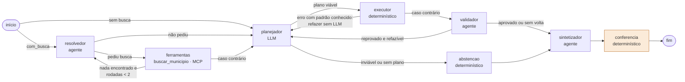

# Grafo da v4

Descrição do grafo LangGraph da v4, montado por `construir_grafo_v4` na célula **C.3** do notebook `20261003_v_entregavel/E4_DallaCosta_Murer_Denzin.ipynb`.

O grafo tem **8 nós**. O slide 5 da apresentação mostra 6 deles; `ferramentas` e `abstencao` aparecem só na legenda.

## Diagrama



## Nós

| Nó | Tipo | O que faz | Chama o LLM? | Para onde vai |
|---|---|---|---|---|
| **resolvedor** | agente | Lê a pergunta e o histórico e decide se precisa confirmar municípios. Se precisar, pede `buscar_municipio`. | Sim, 1 chamada por rodada de busca | `ferramentas` se pediu busca; senão, `planejador` |
| **ferramentas** | ferramenta (`ToolNode`) | Executa `buscar_municipio` no servidor MCP, que devolve a grafia do IBGE, os homônimos e o número de participantes. Na v4 a chamada tem retentativa, tempo limite de 20 s e degradação declarada. | Não | De volta ao `resolvedor` se a busca não encontrou nada (até 2 rodadas); senão, `planejador` |
| **planejador** | etapa | Gera o `PlanoConsulta` (código pandas, colunas usadas, se é viável) com o mesmo prompt da v1. Na volta, recebe a instrução de correção. | Sim, 1 chamada | `executor` se o plano é viável; senão, `abstencao` |
| **executor** | determinístico | Passa o código pela guarda sintática e executa. Se o erro tem padrão conhecido, monta a correção ali mesmo (refazer sem LLM). | Não | `planejador` se gerou correção; senão, `validador` |
| **validador** | agente | Escolhe 1 de 3 skills (`checar_valor_unico`, `checar_conjunto`, `checar_execucao`) e julga o resultado. Na v4, devolve o `Veredito` como ferramenta do laço. | Sim, 1 chamada (2 se responder em texto) | `planejador` se reprovou por erro de execução ou código que não responde e ainda há voltas; senão, `sintetizador` |
| **abstencao** | determinístico | Monta a ficha de "não é possível responder" com o motivo do plano, ou com o erro, se o plano não veio. | Não | `sintetizador` |
| **sintetizador** | agente | Redige a resposta só a partir da ficha. Se falhar, monta uma resposta de reserva da ficha, sem LLM. Marca o texto como degradado quando algum nó degradou. | Sim, 1 chamada (0 na reserva) | `conferencia` |
| **conferencia** | determinístico (novo na v4) | Roda as 3 verificações da C.1 (`evidencia_na_fonte`, `dentro_do_escopo`, `confianca_compativel`). Ao achar problema, anexa o aviso ao texto, sem reprovar nem refazer. | Não | fim |

## Regras do grafo

**Entrada.** O grafo começa no `resolvedor`. Com `com_busca=False`, começa direto no `planejador`.

**Uma única porta de volta.** O campo `correcao` do estado é o único caminho de volta ao `planejador`. Só dois nós o preenchem:
- o `executor`, sem LLM, quando o erro tem padrão conhecido (`correcao_deterministica`);
- o `validador`, com LLM, quando reprova por `erro_de_execucao` ou `codigo_nao_responde`.

**Limites.**

| Constante | Valor | O que limita |
|---|---|---|
| `MAX_REESCRITAS` | 2 | voltas ao planejador por pergunta (a v3 permitia 1) |
| `MAX_RODADAS_BUSCA` | 2 | rodadas de busca do resolvedor quando nada foi encontrado |
| `LIMITE_PASSOS_V4` | 30 | transições do grafo inteiro (a v3 usava 25) |
| `LIMITE_PASSOS_AGENTE` | 8 | passos do laço interno de um agente |
| `TENTATIVAS_MODELO` | 3 | tentativas por chamada ao provedor, com espera de 2 s e 4 s |

**Degradação.** Quando falham, `resolvedor`, `planejador`, `validador` e `sintetizador` registram a falha em `degradado` e `motivos_degradacao`. A ferramenta degradada também é detectada pelo `planejador`. O `sintetizador` põe a marca `[resposta em modo degradado]` no texto entregue, de modo que o usuário vê a degradação, e não só o trace.

## Exemplo: T17, rodada 2

Pergunta: "Qual é a média em matemática de Santana do Livramento, e quantos participantes ela teve?"

```
resolvedor › ferramentas › planejador › executor (refazer sem LLM) › planejador › executor › validador › sintetizador › conferencia
```

1. O `resolvedor` pede `buscar_municipio("Santana do Livramento")`.
2. O nó `ferramentas` devolve a grafia `Sant'Ana do Livramento`.
3. O `planejador` escreve a consulta, que a guarda recusa.
4. O `executor` reconhece o padrão e devolve a correção sem chamar o modelo.
5. A segunda versão executa.
6. O `validador` aprova, o `sintetizador` redige e a `conferencia` não encontra problemas.

Resultado: 530,26 e 275 participantes, com 5 chamadas ao LLM.

O nó `ferramentas` não grava linha no trace. Por isso as rotas no notebook e no slide 7 não o mostram: `resolvedor › planejador › …`.
